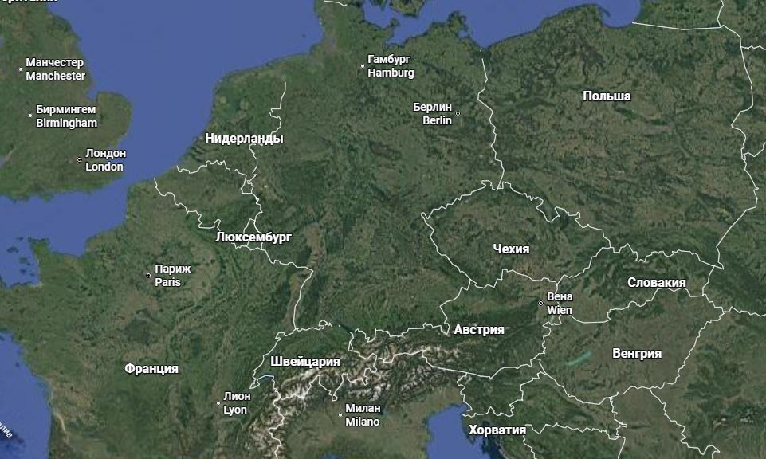
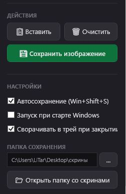
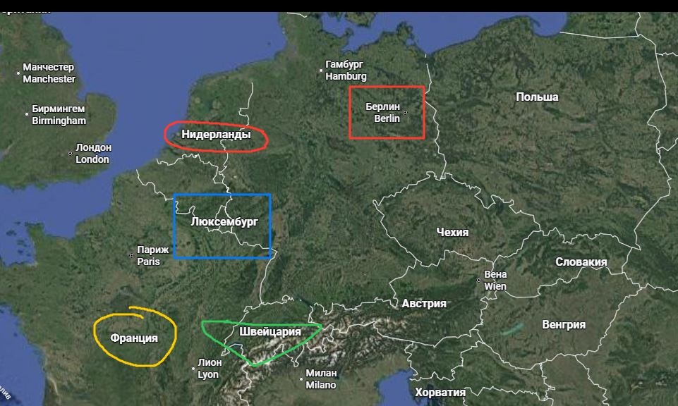

# Screenshot Saver & Editor 📸✂️

Современная, ультралегкая и функциональная утилита для автоматического сохранения скриншотов буфера обмена и их быстрого редактирования в стиле Windows 11.

---

## ✨ Основные возможности

* **⚡ Автосохранение после `Win+Shift+S`**: Приложение работает в фоне и автоматически перехватывает снимки экрана, сделанные стандартными ножницами Windows. Скриншоты сохраняются в выбранную папку в формате lossless PNG без лишних кликов.
* **🧠 Умная оптимизация памяти (RAM)**:
  * В фоновом режиме потребление ОЗУ падает до **1.5 – 3 МБ** (вместо 64+ МБ у стандартных WPF-приложений) благодаря периодической выгрузке неактивных страниц памяти (Win32 Working Set Trimming).
  * История изменений (Undo) сжимается в PNG прямо в оперативной памяти, экономя до **98% ОЗУ** по сравнению с хранением растровых картинок.
* **🪶 Минимальный размер EXE**: Приложение компилируется в один файл (Single-File) и не содержит встроенного рантайма .NET (Framework-Dependent). Итоговый размер исполняемого файла составляет всего **~515 КБ**!
* **🎨 Современный дизайн (Fluent Dark)**: Интерфейс выполнен в темных тонах в соответствии с гайдлайнами Windows 11:
  * Боковая панель для настроек и инструментов.
  * Кастомная строка заголовка с поддержкой перетаскивания и Fluent-кнопками управления окном.
  * Интерактивный экран-заглушка с подсказками при запуске.
* **✍️ Векторный редактор рисунков**:
  * Рисование кистью с регулировкой цвета (4 базовых цвета) и толщины.
  * Быстрое рисование прямоугольников для выделения областей.
  * Инструмент «Ластик» для стирания штрихов.
  * Обрезка кадров пиксель-в-пиксель.
* **🔙 Шаги отката (Ctrl+Z)**: Память истории на **10 шагов**, позволяющая легко отменять рисунки, стирания, очистку или обрезку.
* **🔍 Масштабирование холста (Zoom)**: Приближение и отдаление холста от **20% до 400%** с помощью сочетания клавиш **Ctrl + колесико мыши** и кнопка быстрого сброса до 100%.
* **🚀 Автозагрузка и Работа в фоне**:
  * Опция автоматического запуска при старте Windows (управляется через реестр, отображается в Диспетчере задач).
  * Опция закрытия в системный трей (меню с возможностью быстро открыть редактор, открыть папку со снимками или завершить процесс).
  * Поддержка запуска в свернутом виде (параметр `--background` при старте).

---

## 🖼️ Скриншоты интерфейса

### Главное окно редактора


### Панель инструментов и настроек в сайдбаре


### Пример рисования на холсте


### Демонстрационный эскиз


---

## ⚙️ Системные требования

* **Операционная система**: Windows 10 / Windows 11
* **Платформа**: Установленный [.NET 10.0 Desktop Runtime](https://dotnet.microsoft.com/download/dotnet/10.0) (требуется для работы приложения, так как рантайм исключен из сборки ради минимального размера файла).

---

## 🛠️ Сборка проекта

Вы можете скомпилировать проект самостоятельно с помощью .NET 10 SDK.

Для сборки оптимизированной версии в один файл (Single-File) без включения рантайма выполните команду в корневой папке проекта:
```powershell
dotnet publish -c Release -r win-x64 --no-self-contained
```

Исполняемый файл будет сгенерирован по пути:
`bin\Release\net10.0-windows\win-x64\publish\ScreenshotSaver.exe`
Размер готового файла составит всего **~515 КБ**.

---

## 📂 Структура проекта

* `AppConfig.cs` — Сериализация и сохранение настроек пользователя в JSON (`%AppData%\ScreenshotSaver\config.json`).
* `StartupManager.cs` — Управление автозагрузкой приложения через системный реестр Windows.
* `MainWindow.xaml` / `MainWindow.xaml.cs` — Основная разметка Fluent-интерфейса и логика редактора, масштабирования, отката действий, системного трея и перехвата буфера обмена.
* `App.xaml` / `App.xaml.cs` — Управление точкой входа и логика фонового запуска с ключом `--background`.
